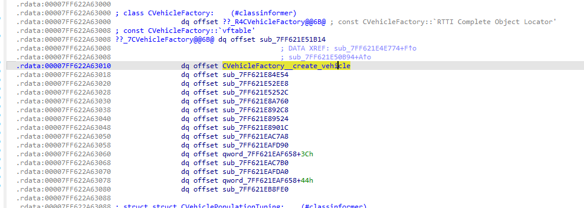
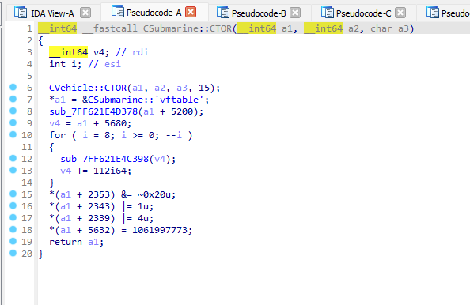
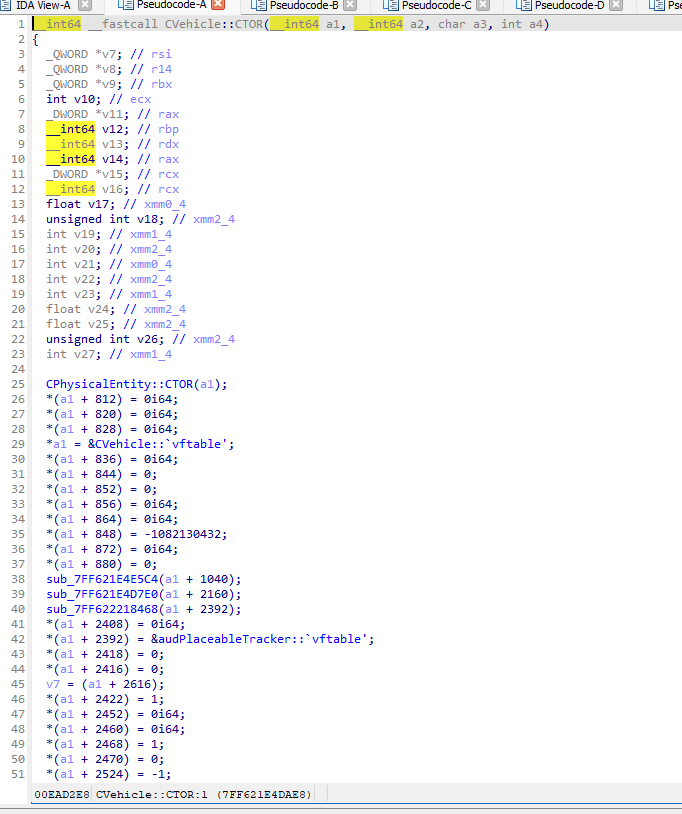

IDA stands for Interactive Disassembler, it is a disassembler for computer software which transforms the machine-code executable into assembly language source code.

It also generates higher C-pseudocode representation of the analysed program, here is an example of the output when I do static analysis in the process of reverse engineering various apps (gta games, malwaves, ...)

> here is what we call a vtable, the data structure behind classes and inheritance in memory

> here is a vehicle (submarine) ctor, we clearly see the inheritance as the first call is the super CVehicle::CTOR call, and then the entity pointer is assigned to the CSubmarine vtable, a pattern we see all the time in the object oriented paradigm

> one more example, same pattern, a lot of things getting set to the entity

## The script

To quickly explain how memory works, it's just bytes, everytime you start an application the absolute adress of that programm (module) is randomized and decided by the OS. But, the relative adresses doesnt change, aslong as the programm did not receive an update.

For our code to interact and / or modify that programm, and make sure that it wont break on updates, we use memory patterns (something similar to "01 7F AC 78 ?? 00", for example). Those are just bytes, the ?? being wildcards aka dynamic bytes changing on every application start. The goal, is to scan the memory to find those bytes and then we know where to poke.

This script, make sure that the patterns in my code are still valid by interacting with the IDA python api, this is not meant to the public use as the CMemory class I'm using is closed source
